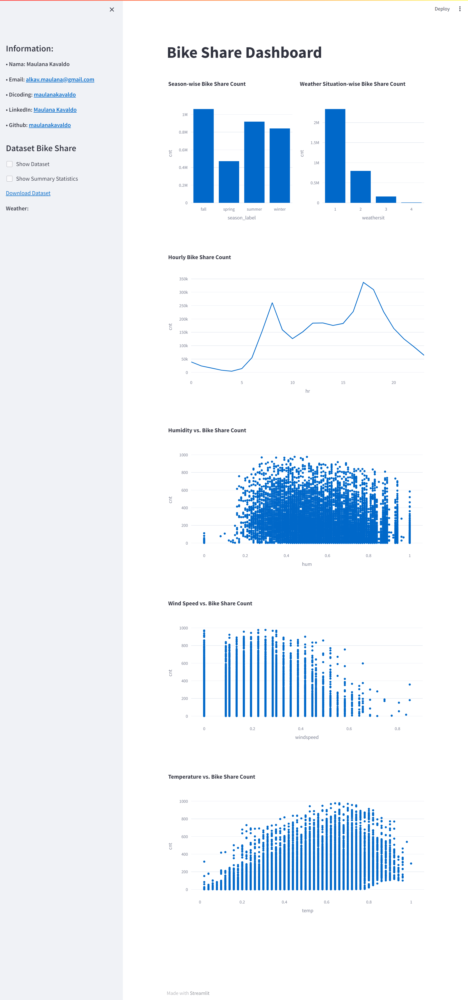

# Belajar Analisis Data dengan Python

## Dataset: Bike Sharing 
[Bike Sharing Dataset](https://drive.google.com/file/d/1RaBmV6Q6FYWU4HWZs80Suqd7KQC34diQ/view?usp=sharing)

## Streamlit Cloud :
Streamlit Cloud : [Bike Sharing Dashboard](https://maulanakavaldo-dicoding-bikesharing.streamlit.app/)



## Setup environment
- Install Visual Studio Code for Editor
- Execute this command on command line ( as administrato prefered)
```
pip install pandas streamlit plotly scikit-learn
```

## Project installation
The steps to create your virtual environment from this project is as follows:

1. Clone this repository
   ```
   git clone https://github.com/maulanakavaldo/bike_sharing.git
   ```

2. Move to directory Dicoding-BADP
   ```
   cd bike_sharing
   ```
3. Run streamlit app
   ```
   streamlit run bike-sharing-dashboard.py
   ```
4. Stop the application program by `ctrl + c`.